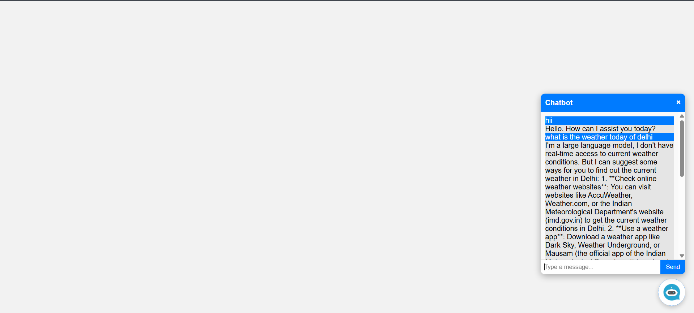
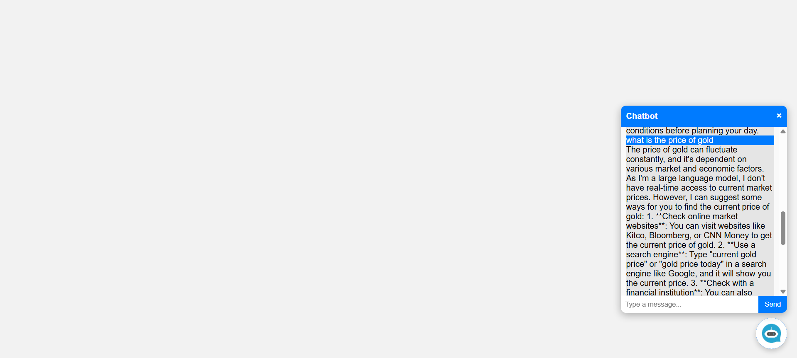

# 🤖 Chatbot Project

A fully functional **chatbot** application with a sleek frontend, powered by Node.js backend. Users can interact with the bot and upload images to enhance the chat experience.

## ✨ Features

* 💬 Interactive chatbot interface with HTML, CSS, and JavaScript
* ⚡ Node.js backend handling chatbot logic and API requests
* 🔒 Environment variables managed with `.env` file for secure configuration
* 📱 Responsive design for desktop and mobile

## 📂 Project Structure

```
chatbot/
│
├─ frontend/
│  ├─ index.html        # Chat interface
│  ├─ style.css         # Styling
│  └─ script.js         # Chatbot logic on frontend
│
├─ backend/
│  ├─ server.js         # Node.js server
│  ├─ .env                 # Environment variables
│  ├─ package.json         # Node.js dependencies
│
└─ README.md            # Project documentation
```

## ⚙️ Installation

1. Clone the repository:

```bash
git clone https://github.com/yourusername/chatbot.git
cd chatbot
```

2. Install dependencies:

```bash
npm install
```

3. Create a `.env` file in the root directory:

```
PORT=3000
API_KEY=your_api_key_here
```

4. Run the server:

```bash
node backend/server.js

type npm start
```


## 🚀 Usage

* 💬 Start typing messages in the chatbox to interact with the chatbot
* 🔑 Environment variables keep your sensitive keys safe and configurable

## 📦 Dependencies

* [Dotenv](https://www.npmjs.com/package/dotenv) – Environment variable management

## 📸 Screenshots

 

---



---

## 🌟 Future Improvements

* 🤖 Add AI-based chatbot responses
* 💾 Store chat history in a database
* 👤 Add user authentication and profiles
* 🎨 Enhance UI with animations and better responsiveness

---
